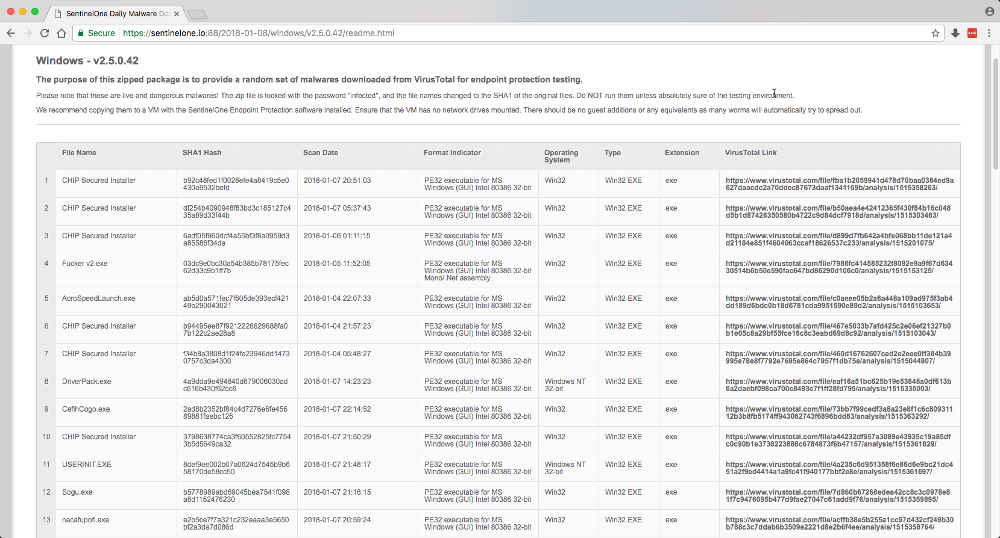

# s1-vtdownloader-service

Information about the SentinelOne VirusTotal Downloader Service is here at the Customer Portal Knowledge Base:

[Daily VirusTotal Downloads](https://support.sentinelone.com/hc/en-us/articles/115005861089-Daily-VirusTotal-Downloads)

The source compiles this project into a Windows Service.
Once compiled and installed, edit the SETTINGS.INI file to configure.
